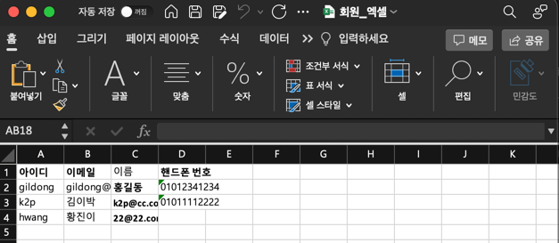

# ExcelMate
해당 프로젝트는 Java 환경에서 데이터를 손쉽게 엑셀 파일로 다운로드할 수 있는 기능을 제공합니다. <br />
Apache POI 라이브러리를 추상화하여, 주어진 데이터를 엑셀 형식으로 변환하고 **OutputStream**을 통해 엑셀 파일을 생성하고 다운로드할 수 있습니다. <br />
이로써 개발자는 엑셀 파일 생성과 관련된 반복적인 작업을 간소화하고, 데이터를 엑셀 파일로 쉽게 내보낼 수 있습니다.
## 주요기능
- **엑셀 파일 생성** : 데이터를 바탕으로 엑셀 파일을 생성합니다.
- **유연한 헤더 관리** : 각 데이터 필드에 대해 @ExcelHeader 어노테이션을 사용하여 엑셀 헤더를 자동으로 설정합니다.
- **동적 데이터 삽입** : 클래스의 필드 값을 엑셀 셀에 동적으로 삽입합니다.
- **대용량 데이터 처리** : `Apache POI`의 `SXSSFWorkbook`을 사용하여 메모리 효율적으로 대용량 데이터를 처리합니다.

## 설치 방법
`excelmate`는 [🔗JitPack](https://jitpack.io/#zinzoddari/excelmate)에 배포되어 있습니다. 아래와 같이 Gradle에 의존성을 추가해주세요.
###### `build.gradle.kts`
```yml
repositories {
    ...
    maven("https://jitpack.io")
}
```
```yml
dependencies {
    implementation 'com.github.zinzoddari:excelmate:Tag'
}
```

## 사용법
### 1. 엑셀 다운 처리를 위한, 클래스 정의
엑셀 파일에 저장할 데이터를 정의하기 위해 클래스에 `@ExcelHeader` 어노테이션을 사용하여 헤더를 지정할 수 있습니다.
```java
public class UserDto {

    @ExcelHeader(value = "아이디", bold = true)
    private String id;

    @ExcelHeader(value = "이메일", bold = true)
    private String email;

    @ExcelFont(bold = true)
    @ExcelHeader("이름")
    private String name;

    @ExcelHeader(value = "핸드폰 번호", bold = true)
    private String phone;

    // 생성자 생략
}
```
- `@ExcelHeader(value = "value")`: 해당 어노테이션을 통해, 엑셀에서 `title`이 설정 되게 됩니다.

### 2. 엑셀 다운로드 메서드 호출
```java
public class Excelmate {

    private static final String FILE_NAME = "회원_엑셀.xlsx";

    public static void main(String[] args) {
        ExcelMate excelMate = new ExcelMate();

        List<UserDto> lists = List.of(new UserDto("gildong", "gildong@dd.com", "홍길동", "01012341234"),
            new UserDto("k2p", "김이박", "k2p@cc.com", "01011112222"),
            new UserDto("hwang", "황진이", "22@22.com", null));

        try (OutputStream outputStream = new FileOutputStream(FILE_NAME)) {
            excelMate.download("회원목록", UserDto.class, lists, outputStream);
        } catch (IOException e) {
            throw new RuntimeException(e);
        }
    }
}
```
#### 주요 메서드 설명
```java
public <T> void download(final String sheetName, final Class<T> tClass, final List<T> data, OutputStream outputStream) throws IOException {
    create(sheetName, tClass, data, outputStream);
}
```
- `sheetName`: 생성할 엑셀 시트의 이름을 지정합니다.
- `tClass`: 엑셀로 변환할 데이터의 클래스 타입을 지정합니다. 이 클래스는 @ExcelHeader 어노테이션을 사용하여 필드별로 헤더를 정의할 수 있습니다.
- `data`: 엑셀에 저장할 데이터 리스트입니다.
- `outputStream`: 엑셀 파일을 저장할 OutputStream 객체입니다. 예를 들어, 파일로 저장하거나 웹 응답으로 전송할 수 있습니다.

### 3. 파일 다운로드
 <br />
위 코드에서 `회원_엑셀.xlsx` 파일이 생성됩니다. 이 파일은 각 사용자 정보를 엑셀 시트로 변환하여 저장합니다. <br />
`OutputStream`은 파일 외에도 HTTP 응답에 사용할 수 있습니다. <br />
웹 애플리케이션에서 다운로드를 제공하려면 `HttpServletResponse`를 사용하여 outputStream을 설정할 수 있습니다.

## 사용 오픈소스 라이브러리
`excelmate`는 다음 라이브러리를 사용하였습니다.
- [Apache POI](https://poi.apache.org/): 엑셀 파일 생성을 위한 주요 라이브러리입니다.

# 기여
이 프로젝트에 기여하려면 이슈를 생성하거나 풀 리퀘스트를 제출해주세요. 기여는 언제나 환영입니다. 😁

# License
이 프로젝트는 [MIT 라이선스](https://opensource.org/license/mit) 하에 배포됩니다.
